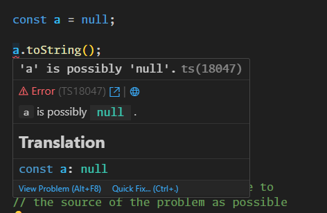
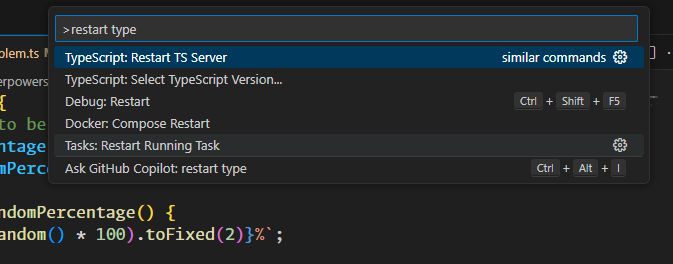
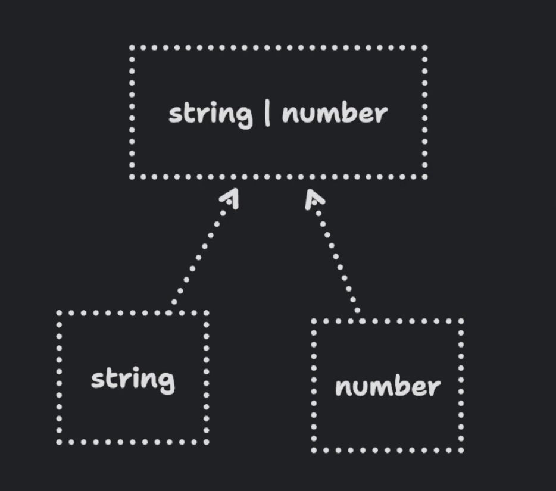
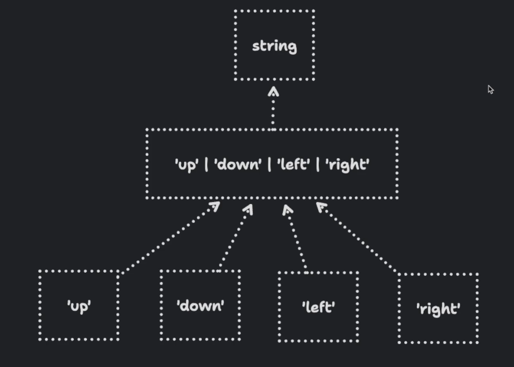
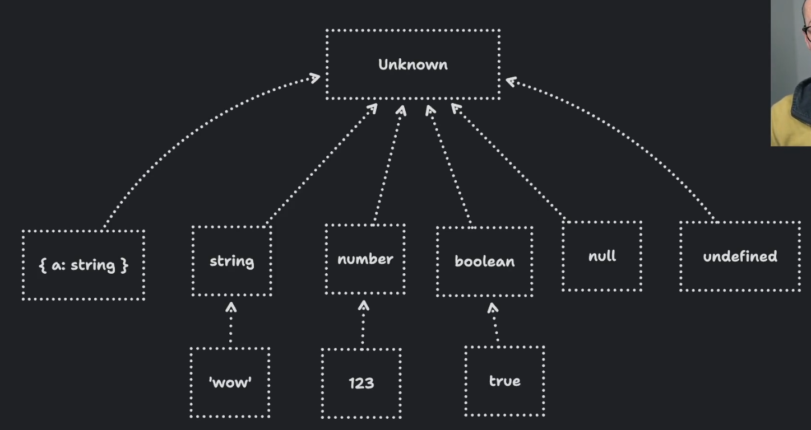
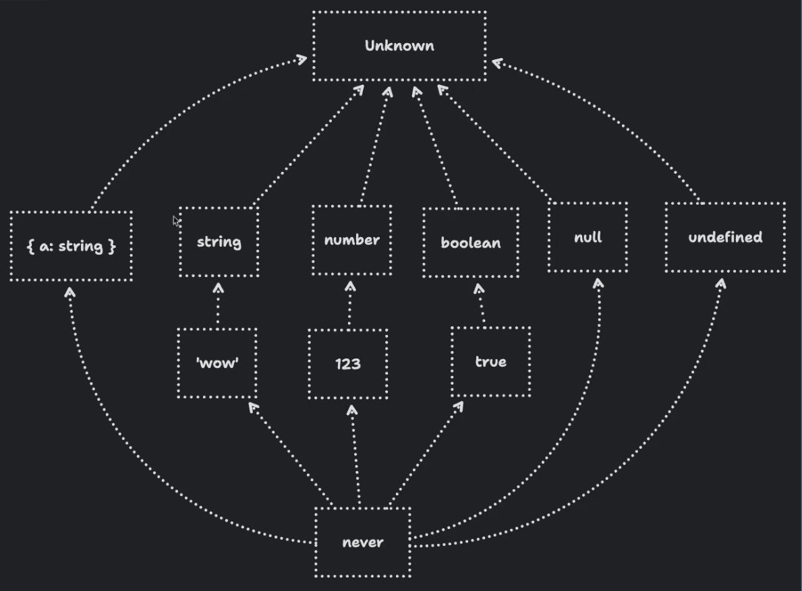

# TypeScript Pro Essentials

## Table of Contents

### 001 TypeScript's Relationship with JavaScript

TypeScript is a superset of JavaScript, meaning it builds on JavaScript by adding static types. This allows developers
to catch errors early in the development process, leading to more robust and maintainable code. TypeScript code is
transpiled to JavaScript, ensuring compatibility with all JavaScript environments.

Key points:

- **Superset of JavaScript**: All JavaScript code is valid TypeScript code.
- **Static Typing**: TypeScript introduces static types, which can help catch errors at compile time.
- **Transpilation**: TypeScript code is transpiled to JavaScript, making it runnable in any environment that supports
  JavaScript.
- **Tooling**: TypeScript offers enhanced tooling and editor support, improving the developer experience.

### 002 JavaScript vs. TypeScript in the Build Process


### 003 Essential Tools for TypeScript Development


### 004 Set up Node.js and VS Code


### 005 Installing pnpm for Package Management

installing pnpm

https://pnpm.io/installation

### 006 Installing t

### 007 Unexpected Token Error in the Browser

```ts
const message = (message: string) => {
    console.log(message);
};

message('Hello World!');
```

```html
<!DOCTYPE html>
<html lang="en">
<head>
    <meta charset="UTF-8">
    <title>Title</title>
</head>
<body>
<script src="example.ts"></script>
</body>
</html>
```


### 008 Browsers Can't Understand TypeScript Syntax

```javascript
const message = (message) => {
    console.log(message);
};

message('Hello World!');
```

```html
<!DOCTYPE html>
<html lang="en">
<head>
    <meta charset="UTF-8">
    <title>Title</title>
</head>
<body>
<script src="example.js"></script>
</body>
</html>
```


### 009 Convert a TypeScript File into a JavaScript File

use the previous example.ts file.

### 010 Compile TypeScript to JavaScript with the TypeScript CLI

let's install typescript globally

```bash
pnpm install -g typescript
```

let's initiate a new project

```bash
tsc --init
```


let's compile the example.ts file

```bash
tsc example.ts
```

### 011 Automating TypeScript Compilation


### 012 Use tsc's Watch Mode to Automatically Compile TypeScript Files

we can use the watch mode to automatically compile the TypeScript files

```bash 
tsc -w
```

### 013 Compiling TypeScript Files to a Directory

we can compile the TypeScript files to a directory by using the `outDir` option in the `tsconfig.json` file

```json
{
  "compilerOptions": {
    "outDir": "./dist"
  }
}
```

[.gitignore](..%2Ftotal-typescript-book%2Fsrc%2F010-typescript-in-the-build-process%2F013-compiling-to-a-directory.problem%2F.gitignore)

### 014 Configure the Output Directory for Compiled Files

### 015 Use Vite for a Frontend App with TypeScript

```bash
pnpm init vite@latest
```

### 016 Configure Vite for a Vanilla TypeScript Project

```bash
pnpm init vite@latest
```

```bash
cd my-vite-project
```

```bash
pnpm install
```

```bash
pnpm run dev
```

### 017 Comparing Vite with tsc

### 018 TypeScript as a Linter

The selected code snippet `"noEmit": true,` is a configuration option within the `tsconfig.json` file for a TypeScript
project. This file is used to specify the compiler options and other settings for the TypeScript compiler (`tsc`).

The `"noEmit"` option, when set to `true`, instructs the TypeScript compiler to not emit any output files. This means
that the compiler will perform all the usual type checking and validation, but it will not generate any JavaScript files
as output. This can be particularly useful in scenarios where TypeScript is used purely for type checking and linting
purposes, rather than for transpiling TypeScript code to JavaScript.

For example, in a project where you want to ensure that your TypeScript code adheres to certain type safety rules
without actually producing JavaScript files, you might set `"noEmit": true` in your `tsconfig.json`:

```jsonc
"noEmit": true,
```

This setting is often used in conjunction with other linting-related options such as `"strict": true`,
`"noUnusedLocals": true`, and `"noUnusedParameters": true`, which enforce stricter type checking and help catch
potential issues early in the development process.

### 019 TypeScript in a CI-CD System

```yaml
name: CI
on:
  # Runs against all pushes
  push:
    branches:
      - "**"

  # Runs against all pull requests
  pull_request:
    branches:
      - "**"

jobs:
  ci:
    # Runs on the latest version of Ubuntu, a linux distro
    runs-on: ubuntu-latest
    steps:
      # Checks out the current branch using git checkout
      - uses: actions/checkout@v3

      # Sets up pnpm with version 7
      - uses: pnpm/action-setup@v2
        with:
          version: 7

      # Sets up node
      - uses: actions/setup-node@v3
        with:
          node-version: 16.x
          # Sets up pnpm's cache
          cache: "pnpm"

      # Install with frozen lockfile to ensure packages
      # are not accidentally updated
      - run: pnpm install --frozen-lockfile

      # Run the 'ci' script defined in package.json
      - run: pnpm run ci

```

### 020 Should TypeScript Block Your Dev Server_

```json
{
  "name": "013-setting-up-a-frontend-app-with-vite.solution",
  "private": true,
  "version": "0.0.0",
  "type": "module",
  "scripts": {
    "ci": "tsc",
    "dev": "run-p dev:*",
    "dev:vite": "vite",
    "dev:tsc": "tsc --watch",
    "build": "tsc && vite build",
    "preview": "vite preview"
  },
  "devDependencies": {
    "typescript": "^5.0.2",
    "vite": "^4.4.5",
    "npm-run-all": "^4.1.5"
  }
}

```

### 021 Quickly Create Scripts with tsx

[doSomething.ts](..%2Ftotal-typescript-book%2Fsrc%2F010-typescript-in-the-build-process%2F019-using-tsx-to-create-quick-scripts.explainer%2Fscripts%2FdoSomething.ts)

```json
{
  "name": "013-setting-up-a-frontend-app-with-vite.solution",
  "private": true,
  "version": "0.0.0",
  "type": "module",
  "scripts": {
    "do-something": "tsx scripts/doSomething.ts",
    "ci": "tsc",
    "dev": "vite",
    "build": "tsc && vite build",
    "preview": "vite preview"
  },
  "devDependencies": {
    "tsx": "^3.12.7",
    "typescript": "^5.0.2",
    "vite": "^4.4.5"
  }
}

```

### 022 Understanding Function Errors

[020-basic-types-with-function-parameters.problem.ts](..%2Ftotal-typescript-book%2Fsrc%2F015-essential-types-and-annotations%2F020-basic-types-with-function-parameters.problem.ts)

### 023 Fixing Errors in the

[020-basic-types-with-function-parameters.solution.ts](..%2Ftotal-typescript-book%2Fsrc%2F015-essential-types-and-annotations%2F020-basic-types-with-function-parameters.solution.ts)

### 024 Annotating Empty Parameters

[021-annotating-empty-parameters.problem.ts](..%2Ftotal-typescript-book%2Fsrc%2F015-essential-types-and-annotations%2F021-annotating-empty-parameters.problem.ts)

### 025 Annotating Function Parameters

[021-annotating-empty-parameters.solution.ts](..%2Ftotal-typescript-book%2Fsrc%2F015-essential-types-and-annotations%2F021-annotating-empty-parameters.solution.ts)

### 026 Basic Types in TypeScript

[022-all-types.problem.ts](..%2Ftotal-typescript-book%2Fsrc%2F015-essential-types-and-annotations%2F022-all-types.problem.ts)

### 027 TypeScript Basic Types

```ts
let example1: string = "Hello World!";
let example2: number = 42;
let example3: boolean = true;
let example4: symbol = Symbol();
let example5: bigint = 123n;
```

### 028 Optional Function Parameters

```ts
import {Expect, Equal} from "@total-typescript/helpers";

const concatName = (first: string, last: string) => {
    if (!last) {
        return first;
    }

    return `${first} ${last}`;
};

const result = concatName("John", "Doe");

type test = Expect<Equal<typeof result, string>>;

const result2 = concatName("John");

type test2 = Expect<Equal<typeof result2, string>>;

```

### 029 Optional Function Parameters in TypeScript

```ts
import {Equal, Expect} from "@total-typescript/helpers";

const concatName = (first: string, last ?: string) => {
    if (!last) {
        return first;
    }

    return `${first} ${last}`;
};

const result = concatName("John", "Doe");

type test = Expect<Equal<typeof result, string>>;

const result2 = concatName("John");

type test2 = Expect<Equal<typeof result2, string>>;

```

### 030 Default Parameters in JavaScript Functions

```ts
import {Expect, Equal} from "@total-typescript/helpers";

import {expect, it} from "vitest";

const concatName = (first: string, last?: string) => {
    if (!last) {
        return first;
    }

    return `${first} ${last}`;
};

it("should return the full name", () => {
    const result = concatName("John", "Doe");

    type test = Expect<Equal<typeof result, string>>;

    expect(result).toEqual("John Doe");
});

it("should return the first name", () => {
    const result = concatName("John");

    type test = Expect<Equal<typeof result, string>>;

    expect(result).toEqual("John Pocock");
});

```

### 031 Add a Default Parameter

```ts
import {Equal, Expect} from "@total-typescript/helpers";

import {expect, it} from "vitest";

const concatName = (first: string, last: string = "Pocock") => {
    return `${first} ${last}`;
};

it("should return the full name", () => {
    const result = concatName("John", "Doe");

    type test = Expect<Equal<typeof result, string>>;

    expect(result).toEqual("John Doe");
});

it("should return the first name", () => {
    const result = concatName("John");

    type test = Expect<Equal<typeof result, string>>;

    expect(result).toEqual("John Pocock");
});

```

### 032 Typing Object Literals

```ts
import {Expect, Equal} from "@total-typescript/helpers";
import {expect, it} from "vitest";

const concatName = (user) => {
    return `${user.first} ${user.last}`;
};

it("should return the full name", () => {
    const result = concatName({
        first: "John",
        last: "Doe",
    });

    type test = Expect<Equal<typeof result, string>>;

    expect(result).toEqual("John Doe");
});

```

### 033 Annotating with {}

```ts
import {Expect, Equal} from "@total-typescript/helpers";
import {expect, it} from "vitest";

const concatName = (user: { first: string; last: string }) => {
    return `${user.first} ${user.last}`;
};

it("should return the full name", () => {
    const result = concatName({
        first: "John",
        last: "Doe",
    });

    type test = Expect<Equal<typeof result, string>>;

    expect(result).toEqual("John Doe");
});

```

### 034 Making Object Property Types Optional

```ts
import {Expect, Equal} from "@total-typescript/helpers";
import {expect, it} from "vitest";

// CODE

const concatName = (user: { first: string; last: string }) => {
    if (!user.last) {
        return user.first;
    }
    return `${user.first} ${user.last}`;
};

// TESTS

it("should return the full name", () => {
    const result = concatName({
        first: "John",
        last: "Doe",
    });

    type test = Expect<Equal<typeof result, string>>;

    expect(result).toEqual("John Doe");
});

it("should only return the first name if last name not provided", () => {
    const result = concatName({
        first: "John",
    });

    type test = Expect<Equal<typeof result, string>>;

    expect(result).toEqual("John");
});

```

### 035 Specifying Optional Properties

```ts
import {Expect, Equal} from "@total-typescript/helpers";
import {expect, it} from "vitest";

// CODE

const concatName = (user: { first: string; last?: string }) => {
    if (!user.last) {
        return user.first;
    }
    return `${user.first} ${user.last}`;
};

// TESTS

it("should return the full name", () => {
    const result = concatName({
        first: "John",
        last: "Doe",
    });

    type test = Expect<Equal<typeof result, string>>;

    expect(result).toEqual("John Doe");
});

it("should only return the first name if last name not provided", () => {
    const result = concatName({
        first: "John",
    });

    type test = Expect<Equal<typeof result, string>>;

    expect(result).toEqual("John");
});

```

### 036 A Single Source of Truth for Type Definitions

```ts
import {Expect, Equal} from "@total-typescript/helpers";
import {expect, it} from "vitest";

const getRectangleArea = (rectangle: { width: number; height: number }) => {
    return rectangle.width * rectangle.height;
};

const getRectanglePerimeter = (rectangle: {
    width: number;
    height: number;
}) => {
    return 2 * (rectangle.width + rectangle.height);
};

it("should return the area of a rectangle", () => {
    const result = getRectangleArea({
        width: 10,
        height: 20,
    });

    type test = Expect<Equal<typeof result, number>>;

    expect(result).toEqual(200);
});

it("should return the perimeter of a rectangle", () => {
    const result = getRectanglePerimeter({
        width: 10,
        height: 20,
    });

    type test = Expect<Equal<typeof result, number>>;

    expect(result).toEqual(60);
});

```

### 037 Creating

```ts
import {Equal, Expect} from "@total-typescript/helpers";
import {expect, it} from "vitest";

type Rectangle = {
    width: number;
    height: number;
};


const getRectangleArea = (rectangle: Rectangle) => {
    return rectangle.width * rectangle.height;
};

const getRectanglePerimeter = (rectangle: Rectangle) => {
    return 2 * (rectangle.width + rectangle.height);
};

it("should return the area of a rectangle", () => {
    const result = getRectangleArea({
        width: 10,
        height: 20,
    });

    type test = Expect<Equal<typeof result, number>>;

    expect(result).toEqual(200);
});

it("should return the perimeter of a rectangle", () => {
    const result = getRectanglePerimeter({
        width: 10,
        height: 20,
    });

    type test = Expect<Equal<typeof result, number>>;

    expect(result).toEqual(60);
});
```

### 038 Add an Array to an Object

```ts
// CODE

// How do we type 'items' in the ShoppingCart?
type ShoppingCart = {
    userId: string;
};

// TESTS

const processCart = (cart: ShoppingCart) => {
    // Do something with the cart in here
};

processCart({
    userId: "user123",
    items: ["item1", "item2", "item3"],
});

```

### 039 Two Syntaxes for Arrays

```ts
// CODE

// How do we type 'items' in the ShoppingCart?
type ShoppingCart = {
    userId: string;
    items: string[];
};

// TESTS

const processCart = (cart: ShoppingCart) => {
    // Do something with the cart in here
};

processCart({
    userId: "user123",
    items: ["item1", "item2", "item3"],
});

```

```ts
// How do we type 'items' in the ShoppingCart?
type ShoppingCart = {
    userId: string;
    items: Array<string>;
};

const processCart = (cart: ShoppingCart) => {
    // Do something with the cart in here
};

processCart({
    userId: "user123",
    items: ["item1", "item2", "item3"],
});

```

### 040 Arrays of Objects in TypeScript

```ts
type Recipe = {
    title: string;
    instructions: string;
};

const processRecipe = (recipe: Recipe) => {
    // Do something with the recipe in here
};

processRecipe({
    title: "Chocolate Chip Cookies",
    ingredients: [
        {name: "Flour", quantity: "2 cups"},
        {name: "Sugar", quantity: "1 cup"},
    ],
    instructions: "...",
});

```

### 041 Representing an Array of Objects

```ts
type Recipe = {
    title: string;
    instructions: string;
    ingredients: {
        name: string;
        quantity: string;
    }[];
};

const processRecipe = (recipe: Recipe) => {
    // Do something with the recipe in here
};

processRecipe({
    title: "Chocolate Chip Cookies",
    ingredients: [
        {name: "Flour", quantity: "2 cups"},
        {name: "Sugar", quantity: "1 cup"},
    ],
    instructions: "...",
});

```

```ts
type Ingredient = {
    name: string;
    quantity: string;
};

type Recipe = {
    title: string;
    instructions: string;
    ingredients: Ingredient[];
};

const processRecipe = (recipe: Recipe) => {
    // Do something with the recipe in here
};

processRecipe({
    title: "Chocolate Chip Cookies",
    ingredients: [
        {name: "Flour", quantity: "2 cups"},
        {name: "Sugar", quantity: "1 cup"},
    ],
    instructions: "...",
});

```

```ts
type Ingredient = {
    name: string;
    quantity: string;
};

type Recipe = {
    title: string;
    instructions: string;
    ingredients: Array<Ingredient>;
};

const processRecipe = (recipe: Recipe) => {
    // Do something with the recipe in here
};

processRecipe({
    title: "Chocolate Chip Cookies",
    ingredients: [
        {name: "Flour", quantity: "2 cups"},
        {name: "Sugar", quantity: "1 cup"},
    ],
    instructions: "...",
});

```

```ts
type Recipe = {
    title: string;
    instructions: string;
    ingredients: Array<{
        name: string;
        quantity: string;
    }>;
};

const processRecipe = (recipe: Recipe) => {
    // Do something with the recipe in here
};

processRecipe({
    title: "Chocolate Chip Cookies",
    ingredients: [
        {name: "Flour", quantity: "2 cups"},
        {name: "Sugar", quantity: "1 cup"},
    ],
    instructions: "...",
});

```

### 042 Rest Parameters in TypeScript

```ts
import {Expect, Equal} from "@total-typescript/helpers";
import {expect, it} from "vitest";

export function concatenate(...strings) {
    return strings.join("");
}

it("should concatenate strings", () => {
    const result = concatenate("Hello", " ", "World");
    expect(result).toEqual("Hello World");

    type test = Expect<Equal<typeof result, string>>;
});

```

### 043 Using Rest Parameters in TypeScript

```ts
import {Expect, Equal} from "@total-typescript/helpers";
import {expect, it} from "vitest";

export function concatenate(...strings: string[]) {
    return strings.join("");
}

it("should concatenate strings", () => {
    const result = concatenate("Hello", " ", "World");
    expect(result).toEqual("Hello World");

    type test = Expect<Equal<typeof result, string>>;
});

```

```ts
import {Expect, Equal} from "@total-typescript/helpers";
import {expect, it} from "vitest";

export function concatenate(...strings: Array<string>) {
    return strings.join("");
}

it("should concatenate strings", () => {
    const result = concatenate("Hello", " ", "World");
    expect(result).toEqual("Hello World");

    type test = Expect<Equal<typeof result, string>>;
});

```

### 044 Tuples for Precise Array Structures in TypeScript

```ts
import {Expect, Equal} from "@total-typescript/helpers";

const setRange = (range: Array<number>) => {
    const x = range[0];
    const y = range[1];

    // Do something with x and y in here

    // x and y should both be numbers!
    type tests = [
        Expect<Equal<typeof x, number>>,
        Expect<Equal<typeof y, number>>,
    ];
};

setRange([0, 10]);

// @ts-expect-error string is not assignable to number
setRange([0, "10"]);

// @ts-expect-error too few arguments
setRange([0]);

// @ts-expect-error too many arguments
setRange([0, 10, 20]);

```

### 045 Using Tuple Syntax in TypeScript

```ts
import {Expect, Equal} from "@total-typescript/helpers";

const setRange = (range: [number, number]) => {
    const x = range[0];
    const y = range[1];

    // Do something with x and y in here

    type tests = [
        Expect<Equal<typeof x, number>>,
        Expect<Equal<typeof y, number>>,
    ];
};

setRange([0, 10]);

// @ts-expect-error string is not assignable to number
setRange([0, "10"]);

// @ts-expect-error too few arguments
setRange([0]);

// @ts-expect-error too many arguments
setRange([0, 10, 20]);

```

```ts
import {Expect, Equal} from "@total-typescript/helpers";

const setRange = (range: [x: number, y: number]) => {
    const x = range[0];
    const y = range[1];

    // Do something with x and y in here

    type tests = [
        Expect<Equal<typeof x, number>>,
        Expect<Equal<typeof y, number>>,
    ];
};

setRange([0, 10]);

// @ts-expect-error string is not assignable to number
setRange([0, "10"]);

// @ts-expect-error too few arguments
setRange([0]);

// @ts-expect-error too many arguments
setRange([0, 10, 20]);

```

### 046 Using Optional Tuple Members in TypeScript

```ts
import {Expect, Equal} from "@total-typescript/helpers";

const goToLocation = (coordinates: Array<number>) => {
    const latitude = coordinates[0];
    const longitude = coordinates[1];
    const elevation = coordinates[2];

    // Do something with latitude, longitude, and elevation in here

    type tests = [
        Expect<Equal<typeof latitude, number>>,
        Expect<Equal<typeof longitude, number>>,
        Expect<Equal<typeof elevation, number | undefined>>,
    ];
};

goToLocation([10, 20]);

// @ts-expect-error string is not assignable to number
goToLocation([10, "20"]);

goToLocation([10, 20, 30]);

```

### 047 Working with Optional Tuple Members in TypeScript

```ts
import {Expect, Equal} from "@total-typescript/helpers";

const goToLocation = (
    coordinates: [latitude: number, longitude: number, elevation?: number],
) => {
    const latitude = coordinates[0];
    const longitude = coordinates[1];
    const elevation = coordinates[2];

    // Do something with latitude, longitude, and elevation in here

    type tests = [
        Expect<Equal<typeof latitude, number>>,
        Expect<Equal<typeof longitude, number>>,
        Expect<Equal<typeof elevation, number | undefined>>,
    ];
};

goToLocation([10, 20]);

// @ts-expect-error string is not assignable to number
goToLocation([10, "20"]);

goToLocation([10, 20, 30]);

```

```ts
import {Expect, Equal} from "@total-typescript/helpers";

const goToLocation = (coordinates: [number, number, number?]) => {
    const latitude = coordinates[0];
    const longitude = coordinates[1];
    const elevation = coordinates[2];

    // Do something with latitude, longitude, and elevation in here

    type tests = [
        Expect<Equal<typeof latitude, number>>,
        Expect<Equal<typeof longitude, number>>,
        Expect<Equal<typeof elevation, number | undefined>>,
    ];
};

goToLocation([10, 20]);

// @ts-expect-error string is not assignable to number
goToLocation([10, "20"]);

goToLocation([10, 20, 30]);

```

### 048 The Controversial

```ts
import {expect, it} from "vitest";

const handleFormData = (e: any) => {
    e.preventDefault();
    const data = new FormData(e.terget);
    const value = Object.fromEntries(data.entries());
    return value;
};

it("Should handle a form submit", () => {
    const form = document.createElement("form");
    form.innerHTML = `
    <input name="name" value="John Doe" />
  `;

    form.onsubmit = (e) => {
        const value = handleFormData(e);
        expect(value).toEqual({name: "John Doe"});
    };

    form.requestSubmit();

    expect.assertions(1);
});

```

### 049 The Dangers of Using _any_

```ts
import {expect, it} from "vitest";

const handleFormData = (e: any) => {
    e.preventDefault();
    const data = new FormData(e.terget);
    const value = Object.fromEntries(data.entries());
    return value;
};

it("Should handle a form submit", () => {
    const form = document.createElement("form");
    form.innerHTML = `
    <input name="name" value="John Doe" />
  `;

    form.onsubmit = (e) => {
        const value = handleFormData(e);
        expect(value).toEqual({name: "John Doe"});
    };

    form.requestSubmit();

    expect.assertions(1);
});

```

```ts
import {expect, it} from "vitest";

const handleFormData = (e: any) => {
    e.preventDefault();
    const data = new FormData(e.target);
    const value = Object.fromEntries(data.entries());
    return value;
};

it("Should handle a form submit", () => {
    const form = document.createElement("form");
    form.innerHTML = `
    <input name="name" value="John Doe" />
  `;

    form.onsubmit = (e) => {
        const value = handleFormData(e);
        expect(value).toEqual({name: "John Doe"});
    };

    form.requestSubmit();

    expect.assertions(1);
});

```

### 050 Function Types

```ts
type User = {
    id: string;
    name: string;
};

const modifyUser = (users: User[], id: string, makeChange) => {
    return users.map((u) => {
        if (u.id === id) {
            return makeChange(u);
        }
        return u;
    });
};

const users: User[] = [
    {id: "1", name: "John"},
    {id: "2", name: "Jane"},
];

modifyUser(users, "1", (user) => {
    return {...user, name: "Waqas"};
});

modifyUser(
    users,
    "1",
    // @ts-expect-error
    (user) => {
        return {...user, name: 123};
    },
);

```

### 051 Function Types for Type Aliases in TypeScript

```ts
type User = {
    id: string;
    name: string;
};

type MakeChangeFunc = (user: User) => User;

const modifyUser = (users: User[], id: string, makeChange: MakeChangeFunc) => {
    return users.map((u) => {
        if (u.id === id) {
            return makeChange(u);
        }
        return u;
    });
};

const users: User[] = [
    {id: "1", name: "John"},
    {id: "2", name: "Jane"},
];

modifyUser(users, "1", (user) => {
    return {...user, name: "Waqas"};
});

modifyUser(
    users,
    "1",
    // @ts-expect-error
    (user) => {
        return {...user, name: 123};
    },
);

```

### 052 Typing an Event Listener

```ts
const addClickEventListener = (listener) => {
    document.addEventListener("click", listener);
};

addClickEventListener(() => {
    console.log("Clicked!");
});

addClickEventListener(
    // @ts-expect-error
    "abc",
);

```

### 053 The

```ts
type Listener = () => void;

const addClickEventListener = (listener: Listener) => {
    document.addEventListener("click", listener);
};

addClickEventListener(() => {
    console.log("Clicked!");
});

addClickEventListener(
    // @ts-expect-error
    "abc",
);
```

### 054 Restricting

```ts
// CODE

const userIds = new Set();

// TESTS

userIds.add(1);
userIds.add(2);
userIds.add(3);

// @ts-expect-error
userIds.add("123");
// @ts-expect-error
userIds.add({name: "Max"});

```

### 055 Creating Typed Sets

```ts
// CODE

const userIds = new Set<number>();

// TESTS

userIds.add(1);
userIds.add(2);
userIds.add(3);

// @ts-expect-error
userIds.add("123");
// @ts-expect-error
userIds.add({name: "Max"});
```

### 056 Type Checking Maps

```ts
// CODE

const userMap = new Map();

// TESTS

userMap.set(1, {name: "Max", age: 30});
userMap.set(2, {name: "Manuel", age: 31});

// @ts-expect-error
userMap.set("3", {name: "Anna", age: 29});

// @ts-expect-error
userMap.set(3, "123");

```

### 057 Adding Types to Maps

```ts
// CODE

type User = {
    name: string;
    age: number;
};


const userMap = new Map<number, User>();

// TESTS

userMap.set(1, {name: "Max", age: 30});
userMap.set(2, {name: "Manuel", age: 31});

// @ts-expect-error
userMap.set("3", {name: "Anna", age: 29});

// @ts-expect-error
userMap.set(3, "123");

```

### 058 Debugging JSON Parsing

```ts
import {Expect, Equal} from "@total-typescript/helpers";
import {expect, it} from "vitest";

const parsedData = JSON.parse<{
    name: string;
    age: number;
}>('{"name": "Alice", "age": 30}');

type test = Expect<
    Equal<
        typeof parsedData,
        {
            name: string;
            age: number;
        }
    >
>;

it("Should be the correct shape", () => {
    expect(parsedData).toEqual({
        name: "Alice",
        age: 30,
    });
});

```

### 059 Decoding the JSON.parse Error

```ts
import {Equal, Expect} from "@total-typescript/helpers";
import {expect, it} from "vitest";

const parsedData: {
    name: string;
    age: number;
} = JSON.parse('{"name": "Alice", "age": 30}');

type test = Expect<
    Equal<
        typeof parsedData,
        {
            name: string;
            age: number;
        }
    >
>;

it("Should be the correct shape", () => {
    expect(parsedData).toEqual({
        name: "Alice",
        age: 30,
    });
});

```

### 060 Typing Fetch API Responses in Async Functions

```ts
import {Expect, Equal} from "@total-typescript/helpers";

async function fetchData() {
    const response = await fetch("https://api.example.com/data");
    const data = await response.json();
    return data;
}

const example = async () => {
    const data = await fetchData();

    type test = Expect<Equal<typeof data, number>>;
};

```

### 061 Adding Types to an Async Function

```ts
import {Equal, Expect} from "@total-typescript/helpers";

async function fetchData(): Promise<number> {
    const response = await fetch("https://api.example.com/data");
    const data = await response.json();
    return data;
}

const example = async () => {
    const data = await fetchData();

    type test = Expect<Equal<typeof data, number>>;
};

```

### 062 Understanding How TypeScript Works in Your IDE


### 063 Introspecting Variables and Declarations in TypeScript


### 064 Hovering Over a Function Call

```ts
const element = document.getElementById(12);
```

### 065 Fixing Errors with Hovering


### 066 Adding Documentation for Hovers

```ts
const element = document.getElementById("12");
```

### 067 TSDoc Comments

```ts
/**
 * Adds two numbers together.
 *
 * @example
 *
 * myFunction(1, 2)
 */
const myFunction = (a: number, b: number) => {
        return a + b;
    };


myFunction(1, 2);

```

### 068 Manually Triggering Autocomplete

```ts
type MyObj = {
    foo: string;
    bar: number;
    baz: boolean;
};

const acceptsObj = (obj: MyObj) => {
};

acceptsObj({
    // Autocomplete in here!
});

document.addEventListener(
    // Autocomplete this string!
    "",
    (event) => {
        console.log(event);
    },
);

```

### 069 The Control + Space Shortcut

```ts
type MyObj = {
    foo: string;
    bar: number;
    baz: boolean;
};

const acceptsObj = (obj: MyObj) => {
};

acceptsObj({
    bar: 123,
    baz: true,
    foo: "hello",
    // Autocomplete in here!
});

document.addEventListener(
    // Autocomplete this string!
    "",
    (event) => {
        console.log(event);
    },
);

```


### 070 TypeScript's Approach to Errors

```ts
// TypeScript sometimes warns you about
// things which will fail at runtime

const a = null;

a.toString();

// But not everything it warns you
// about will fail at runtime

const obj = {};

obj.foo = "hello";

// It will try to warn you as close to
// the source of the problem as possible

type MyUser = {
  name: string;
};

const user: MyUser = {
  nme: "Katherine",
};

// But sometimes that's not always possible

type FunctionThatReturnsAString = () => string;

const fn: FunctionThatReturnsAString = () => {
  return 123;
};

```



### 071 Quick Renaming in VS Code

```ts
const users = [
  { id: "1", name: "Robin" },
  { id: "2", name: "Dennis" },
  { id: "3", name: "Sara" },
];

// Imagine this function was 10x bigger
// with 10x more references to `id`

// How do we change id to userId?
const filterUsersById = (id: string) => {
  return users.filter((user) => user.id === id);
};

```

### 072 Navigating Code with _Go to Definition_
```ts
// You can use go to definition to jump to the definition of something

const myFunction = () => {
  console.log("Hello!");
};

myFunction();
myFunction();

// This can work across files, too:

import { hiThere } from "./dummy-import";

hiThere();

// As well as on types:

type Example = PropertyKey;

// It can also take you to mysterious places:

document;

```
### 073 Fast Imports in VS Code
```ts
const expirationTimes = [
  SESSION_EXPIRATION_TIME,
  SESSION_EXPIRATION_TIME_IN_SECONDS,
  SESSION_EXPIRATION_TIME_IN_MINUTES,
  SESSION_EXPIRATION_TIME_IN_HOURS,
];

```
### 074 Using Autocomplete and Quick Fix to Import Variables
```ts
import {
  SESSION_EXPIRATION_TIME,
  SESSION_EXPIRATION_TIME_IN_SECONDS,
  SESSION_EXPIRATION_TIME_IN_MINUTES,
  SESSION_EXPIRATION_TIME_IN_HOURS,
} from "./dummy-import";

const expirationTimes = [
  SESSION_EXPIRATION_TIME,
  SESSION_EXPIRATION_TIME_IN_SECONDS,
  SESSION_EXPIRATION_TIME_IN_MINUTES,
  SESSION_EXPIRATION_TIME_IN_HOURS,
];

```
### 075 Organizing Imports in Large Files
```ts
import {
  MAX_PAGE,
  DEFAULT_COLOR,
  DEFAULT_FILTER,
  DEFAULT_PAGE,
  DEFAULT_SORT,
  DEFAULT_USERNAME,
  FILTER_OPTIONS,
} from "./dummy-import-2";

const handlePage = (page: number) => {
  if (page > MAX_PAGE) {
    console.log("Page is too large!");
  }
};

```
### 076 The Organize Imports Hotkey in VS Code
```ts
import {
  MAX_PAGE
} from "./dummy-import-2";

const handlePage = (page: number) => {
  if (page > MAX_PAGE) {
    console.log("Page is too large!");
  }
};

```
### 077 Quick Fix Refactoring
```ts
const func = () => {
  // Refactor this to be its own function
  const randomPercentage = `${(Math.random() * 100).toFixed(2)}%`;
  console.log(randomPercentage);
};

```
### 078 Refactoring with Quick Fixes
```ts
const func = () => {
  // Refactor this to be its own function
  const randomPercentage = generateRandomPercentage();
  console.log(randomPercentage);
};
function generateRandomPercentage() {
  return `${(Math.random() * 100).toFixed(2)}%`;
}


```
### 079 Automatic Code Formatting with Prettier
```ts
// Explain prettier

// Explain how to set up prettier

// Explain how to set up formatOnSave

```
### 080 Restarting the TypeScript Server in VS Code



### 081 Handling Null Values in TypeScript
```ts
import { Equal, Expect } from "@total-typescript/helpers";

function getUsername(username: string) {
  if (username !== null) {
    return `User: ${username}`;
  } else {
    return "Guest";
  }
}

// TESTS

const result = getUsername("Alice");
type test = Expect<Equal<typeof result, string>>;

const result2 = getUsername(null);
type test2 = Expect<Equal<typeof result2, string>>;

```
### 082 Introducing Union Types in TypeScript
```ts
import { Equal, Expect } from "@total-typescript/helpers";

function getUsername(username: string | null) {
  if (username !== null) {
    return `User: ${username}`;
  } else {
    return "Guest";
  }
}

// TESTS

const result = getUsername("Alice");
type test = Expect<Equal<typeof result, string>>;

const result2 = getUsername(null);
type test2 = Expect<Equal<typeof result2, string>>;

```
### 083 Diving Deeper into Unions and Assignability



```ts

```
### 084 Restricting Function Parameters
```ts
function move(direction: string, distance: number) {
  // Move the specified distance in the given direction
}

// TESTS

move("up", 10);
move("left", 5);

move(
  // @ts-expect-error - "up-right" is not a valid direction
  "up-right",
  10,
);

move(
  // @ts-expect-error - "down-left" is not a valid direction
  "down-left",
  20,
);

move(
  "up",
  // @ts-expect-error - "20" is not a valid distance
  "20",
);

```
### 085 Combining Literal & Union Types
```ts
type Direction = "up" | "left" | "down" | "right";

function move(direction: Direction, distance: number) {
  // Move the specified distance in the given direction
}

// TESTS

move("up", 10);
move("left", 5);

move(
  // @ts-expect-error - "up-right" is not a valid direction
  "up-right",
  10
);

move(
  // @ts-expect-error - "down-left" is not a valid direction
  "down-left",
  20
);

move(
  "up",
  // @ts-expect-error - "20" is not a valid distance
  "20"
);

```
### 086 Literal Type Assignability
```ts

```
### 087 Combining Union Types in TypeScript
```ts
import { Equal, Expect } from "@total-typescript/helpers";

type HttpCode = "400" | "401" | "404" | "500" | "200" | "201" | "204";

const handleErrorCase = (code: string) => {
  // An imaginary function where we only handle the errors

  type test = Expect<Equal<typeof code, "400" | "401" | "404" | "500">>;
};

const handleSuccessCase = (code: string) => {
  // An imaginary function where we only handle the success cases

  type test = Expect<Equal<typeof code, "200" | "201" | "204">>;
};

const handleAllCase = (code: HttpCode) => {
  // An imaginary function where we handle all the cases

  type test = Expect<
    Equal<typeof code, "200" | "201" | "204" | "400" | "401" | "404" | "500">
  >;
};

```
### 088 Create New Types By Combining Unions
```ts
import { Equal, Expect } from "@total-typescript/helpers";

type SuccessCode = "200" | "201" | "204";

type ErrorCode = "400" | "401" | "404" | "500";

type HttpCode = SuccessCode | ErrorCode;

const handleErrorCase = (code: ErrorCode) => {
  // An imaginary function where we only handle the errors

  type test = Expect<Equal<typeof code, "400" | "401" | "404" | "500">>;
};

const handleSuccessCase = (code: SuccessCode) => {
  // An imaginary function where we only handle the success cases

  type test = Expect<Equal<typeof code, "200" | "201" | "204">>;
};

const handleAllCase = (code: HttpCode) => {
  // An imaginary function where we handle all the cases

  type test = Expect<
    Equal<typeof code, "200" | "201" | "204" | "400" | "401" | "404" | "500">
  >;
};

```
### 089 How Big Can a Union Be_
```ts
type Alphabet =
  | "a"
  | "b"
  | "c"
  | "d"
  | "e"
  | "f"
  | "g"
  | "h"
  | "i"
  | "j"
  | "k"
  | "l"
  | "m"
  | "n"
  | "o"
  | "p"
  | "q"
  | "r"
  | "s"
  | "t"
  | "u"
  | "v"
  | "w"
  | "x"
  | "y"
  | "z";

type TooBig = `${Alphabet}${Alphabet}${Alphabet}${Alphabet}`;

```

### 090 Resolving Literal Types to Wider Types
```ts
const getResolvedIconSize = (
  iconSize: "small" | "medium" | "large" | string,
) => {
  switch (iconSize) {
    case "small":
      return 16;
    case "medium":
      return 32;
    case "large":
      return 48;
    default:
      return iconSize;
  }
};

// It doesn't give you autocomplete for 'small', 'medium', or 'large'!
getResolvedIconSize("awdawd");

```
### 091 Narrowing Unions with
```ts
const convertTime = (time: string | number) => {
  if (typeof time === "string") {
    console.log(time); // string
  } else {
    console.log(time); // number
  }

  console.log(time); // string | number
};

```
### 092 Conditional Narrowing in TypeScript
```ts
import { expect, it } from "vitest";

function validateUsername(username: string | null): boolean {
  // Rewrite this function to make the error go away
  return username.length > 5;

  return false;
}

it("should return true for valid usernames", () => {
  expect(validateUsername("Matt1234")).toBe(true);

  expect(validateUsername("Alice")).toBe(false);
  expect(validateUsername("Bob")).toBe(false);
});

it("Should return false for null", () => {
  expect(validateUsername(null)).toBe(false);
});
```
### 093 Different Approaches for Narrowing Inputs
```ts
import { expect, it } from "vitest";

function validateUsername(username: string | null): boolean {
  // Rewrite this function to make the error go away
  if (username) {
    return username.length > 5;
  }

  return false;
}

it("should return true for valid usernames", () => {
  expect(validateUsername("Matt1234")).toBe(true);

  expect(validateUsername("Alice")).toBe(false);
  expect(validateUsername("Bob")).toBe(false);
});

it("Should return false for null", () => {
  expect(validateUsername(null)).toBe(false);
});

```
```ts
import { expect, it } from "vitest";

function validateUsername(username: string | null): boolean {
  // Rewrite this function to make the error go away
  if (typeof username === "string") {
    return username.length > 5;
  }

  return false;
}

it("should return true for valid usernames", () => {
  expect(validateUsername("Matt1234")).toBe(true);

  expect(validateUsername("Alice")).toBe(false);
  expect(validateUsername("Bob")).toBe(false);
});

it("Should return false for null", () => {
  expect(validateUsername(null)).toBe(false);
});

```
```ts
import { expect, it } from "vitest";

function validateUsername(username: string | null): boolean {
  // Rewrite this function to make the error go away
  if (typeof username !== "string") {
    return false;
  }

  return username.length > 5;
}

it("should return true for valid usernames", () => {
  expect(validateUsername("Matt1234")).toBe(true);

  expect(validateUsername("Alice")).toBe(false);
  expect(validateUsername("Bob")).toBe(false);
});

it("Should return false for null", () => {
  expect(validateUsername(null)).toBe(false);
});

```
```ts
import { expect, it } from "vitest";

function validateUsername(username: string | null): boolean {
  if (typeof username === "object") {
    return false;
  }

  return username.length > 5;
}

it("should return true for valid usernames", () => {
  expect(validateUsername("Matt1234")).toBe(true);

  expect(validateUsername("Alice")).toBe(false);
  expect(validateUsername("Bob")).toBe(false);
});

it("Should return false for null", () => {
  expect(validateUsername(null)).toBe(false);
});

```
```ts
import { expect, it } from "vitest";

function validateUsername(username: string | null): boolean {
  // Rewrite this function to make the error go away

  if (username === null) return false;

  return username.length > 5;
}

it("should return true for valid usernames", () => {
  expect(validateUsername("Matt1234")).toBe(true);

  expect(validateUsername("Alice")).toBe(false);
  expect(validateUsername("Bob")).toBe(false);
});

it("Should return false for null", () => {
  expect(validateUsername(null)).toBe(false);
});

```
```ts
import { expect, it } from "vitest";

function validateUsername(username: string | null): boolean {
  const isUsernameOK = typeof username === "string";

  if (isUsernameOK) {
    return username.length > 5;
  }

  return false;
}

it("should return true for valid usernames", () => {
  expect(validateUsername("Matt1234")).toBe(true);

  expect(validateUsername("Alice")).toBe(false);
  expect(validateUsername("Bob")).toBe(false);
});

it("Should return false for null", () => {
  expect(validateUsername(null)).toBe(false);
});

```
### 094 Narrowing with Boolean Won't Work
```ts
import { expect, it } from "vitest";

function validateUsername(username: string | null): boolean {
  // Why isn't this working?
  const isUsernameOK = Boolean(username);

  if (isUsernameOK) {
    return username.length > 5;
  }

  return false;
}

it("should return true for valid usernames", () => {
  expect(validateUsername("Matt1234")).toBe(true);

  expect(validateUsername("Alice")).toBe(false);
  expect(validateUsername("Bob")).toBe(false);
});

it("Should return false for null", () => {
  expect(validateUsername(null)).toBe(false);
});

```
### 095 Gotchas When Narrowing a Map in TypeScript
```ts
type Event = {
  message: string;
};

const processUserMap = (eventMap: Map<string, Event>) => {
  if (eventMap.has("error")) {
    const message = eventMap.get("error").message;

    throw new Error(message);
  }
};

```
### 096 Correctly Narrowing a Map in TypeScript
```ts
type Event = {
  message: string;
};

const processUserMap = (eventMap: Map<string, Event>) => {
  const errorEvent = eventMap.get("error");
  if (errorEvent) {
    const message = errorEvent.message;
    throw new Error(message);
  }
};

```
### 097 Narrowing by Throwing Errors
```ts
import { Equal, Expect } from "@total-typescript/helpers";

const appElement = document.getElementById("app");

// How do I ensure that appElement is defined?

type Test = Expect<Equal<typeof appElement, HTMLElement>>;

```
### 098 Throwing Errors to Narrow
```ts
import { Equal, Expect } from "@total-typescript/helpers";

const appElement = document.getElementById("app");

// How do I ensure that appElement is defined?
if (!appElement) {
  throw new Error("App element not found");
}

type Test = Expect<Equal<typeof appElement, HTMLElement>>;

```
### 099 Narrowing with
```ts
import { expect, it } from "vitest";

type APIResponse =
  | {
      data: {
        id: string;
      };
    }
  | {
      error: string;
    };

const handleResponse = (response: APIResponse) => {
  // How do we check if 'data' is in the response?
  if (true) {
    return response.data.id;
  } else {
    throw new Error(response.error);
  }
};

it("Should handle a response with data", () => {
  const response = {
    data: {
      id: "123",
    },
  };

  expect(handleResponse(response)).toBe("123");
});

it("Should handle a response with an error", () => {
  const response = {
    error: "Something went wrong",
  };

  expect(() => handleResponse(response)).toThrow("Something went wrong");
});

```
### 100 Dynamically Handling Different API Responses in
```ts
import { expect, it } from "vitest";

type APIResponse =
  | {
      data: {
        id: string;
      };
    }
  | {
      error: string;
    };

const handleResponse = (response: APIResponse) => {
  // How do we check if 'data' is in the response?
  if ("data" in response) {
    return response.data.id;
  } else {
    throw new Error(response.error);
  }
};

it("Should handle a response with data", () => {
  const response = {
    data: {
      id: "123",
    },
  };

  expect(handleResponse(response)).toBe("123");
});

it("Should handle a response with an error", () => {
  const response = {
    error: "Something went wrong",
  };

  expect(() => handleResponse(response)).toThrow("Something went wrong");
});

```

### 101 Introducing the Unknown Type in TypeScript
```ts
const fn = (input: unknown) => {};

// Anything is assignable to unknown!
fn("hello");
fn(42);
fn(true);
fn({});
fn([]);
fn(() => {});

```



### 102 Dealing with Unknown Errors in TypeScript
```ts
const somethingDangerous = () => {
  if (Math.random() > 0.5) {
    throw new Error("Something went wrong");
  }

  return "all good";
};

try {
  somethingDangerous();
} catch (error) {
  // How do we change this code to make it
  // not show a red squiggly?
  if (true) {
    console.error(error.message);
  }
}

```
### 103 Narrowing with
```ts
const somethingDangerous = () => {
  if (Math.random() > 0.5) {
    throw new Error("Something went wrong");
  }

  return "all good";
};

try {
  somethingDangerous();
} catch (error) {
  // How do we change this code to make it
  // not show a red squiggly?
  if (error instanceof Error) {
    console.error(error.message);
  } else {
    throw error;
  }
}

```
### 104 Narrowing Unknown in a Large Conditional Statement
```ts
import { Equal, Expect } from "@total-typescript/helpers";
import { expect, it } from "vitest";

const parseValue = (value: unknown) => {
  if (true) {
    return value.data.id;
  }

  throw new Error("Parsing error!");
};

it("Should handle a { data: { id: string } }", () => {
  const result = parseValue({
    data: {
      id: "123",
    },
  });

  type test = Expect<Equal<typeof result, string>>;

  expect(result).toBe("123");
});

it("Should error when anything else is passed in", () => {
  expect(() => parseValue("123")).toThrow("Parsing error!");
  expect(() => parseValue(123)).toThrow("Parsing error!");
});

```
### 105 Narrowing Unknown Types in TypeScript
```ts
import { Equal, Expect } from "@total-typescript/helpers";
import { expect, it } from "vitest";

type Value = { data: { id: string } };

const parseValue = (value: unknown) => {
  if (
    value &&
    typeof value === "object" &&
    "data" in value &&
    value.data &&
    typeof value.data === "object" &&
    "id" in value.data &&
    typeof value.data.id === "string"
  ) {
    return value.data.id;
  }

  throw new Error("Parsing error!");
};

it("Should handle a { data: { id: string } }", () => {
  const result = parseValue({
    data: {
      id: "123",
    },
  });

  type test = Expect<Equal<typeof result, string>>;

  expect(result).toBe("123");
});

it("Should error when anything else is passed in", () => {
  expect(() => parseValue("123")).toThrow("Parsing error!");
  expect(() => parseValue(123)).toThrow("Parsing error!");
});

```
### 106 Introducing the Never Type in TypeScript
```ts
// This function returns never, because it never returns!
const getNever = () => {
  throw new Error("This function never returns");
};

// ---------------------------------------------

const fn = (input: never) => {};

// Nothing is assignable to never!
fn("hello");
fn(42);
fn(true);
fn({});
fn([]);
fn(() => {});

// Except for never itself!

fn(getNever());

// ---------------------------------------------

// But we can assign never to anything!

const str: string = getNever();
const num: number = getNever();
const bool: boolean = getNever();
const arr: string[] = getNever();

```


### 107 Solving the Never Type in TypeScript
```ts
type ShoppingCart = {
  items: string[];
};

const shoppingCart: ShoppingCart = {
  items: [],
};

console.log(shoppingCart.items);

shoppingCart.items.push("Apple");
shoppingCart.items.push("Banana");

```
### 108 Empty Arrays and the Never Type in TypeScript
```ts
const shoppingCart: {
  items: string[];
} = {
  items: [],
};

console.log(shoppingCart.items);

shoppingCart.items.push("Apple");
shoppingCart.items.push("Banana");

```
### 109 Narrowing Return Types with TypeScript
```ts
import { Equal, Expect } from "@total-typescript/helpers";

const throwError = (message: string):undefined => {
  throw new Error(message);
};

const handleSearchParams = (params: { id?: string }) => {
  const id = params.id || throwError("No id provided");

  type test = Expect<Equal<typeof id, string>>;

  return id;
};

```
### 110 Returning
```ts
import { Equal, Expect } from "@total-typescript/helpers";

const throwError = (message: string): never => {
  throw new Error(message);
};

const handleSearchParams = (params: { id?: string }) => {
  const id = params.id || throwError("No id provided");

  type test = Expect<Equal<typeof id, string>>;

  return id;
};

```
### 111 Narrowing in Different Scopes
```ts

```
### 112 Narrowing Behavior Across Scopes
```ts

```
### 113 Handling Separate But Related Types
```ts

```
### 114 Improving Type Safety with Discriminated Unions in TypeScript

```ts

```

### 115 Destructuring a Discriminated Union in TypeScript
```ts

```
### 116 Limitations of Destructuring Discriminated Unions
```ts

```
### 117 Narrowing a Discriminated Union with a Switch
```ts

```
### 118 Refactoring to a Switch Statement
```ts

```
### 119 The switch (true) Pattern in TypeScript
```ts

```
### 120 Refining Types with Discriminated Unions of Tuples
```ts

```
### 121 Handle Error and Success States by Narrowing
```ts

```
### 122 Discriminated Booleans
```ts

```
### 123 Discriminated Unions with Boolean Discriminators
```ts

```
### 124 Adding Defaults to a Discriminated Union
```ts

```
### 125 Handling Optional Parameters in Discriminated Unions
```ts

```
### 126 Should You Provide Function Return Types_
```ts

```
### 127 Extending Objects in TypeScript
```ts

```
### 128 Use the Intersection Operator to Extend an Object Type in TypeScript
```ts

```


### 129 Extend an Object Using Interfaces in TypeScript

```ts

```
### 130 Extending Interfaces to Create Hierarchies in TypeScript
```ts

```

### 131 Extending Incompatible Properties

```ts

```
### 132 Comparing Intersections and Interface Extends

```ts

```
### 133 Comparing Intersection and Interface Extends in TypeScript
```ts

```
### 134 Allow Dynamic Keys in TypeScript Types

```ts

```
### 135 Dynamic Keys with Index Signatures and Record Types

```ts

```
### 136 Allow Any String Key while Supporting Default Properties
```ts

```
### 137 Add an Index Signature to an Interface```ts

```